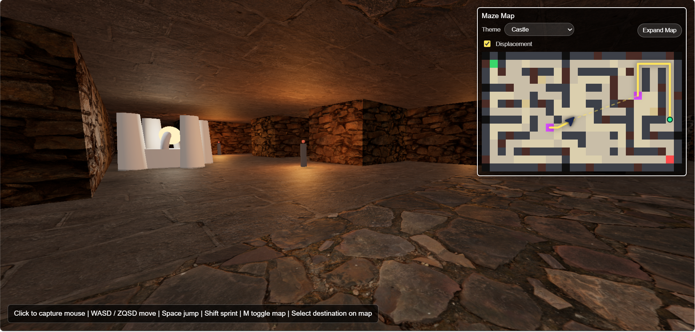
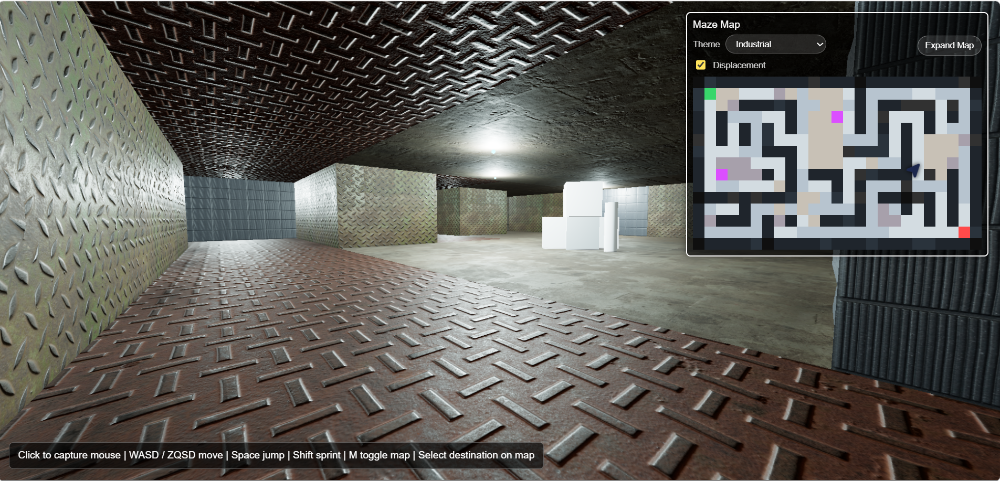
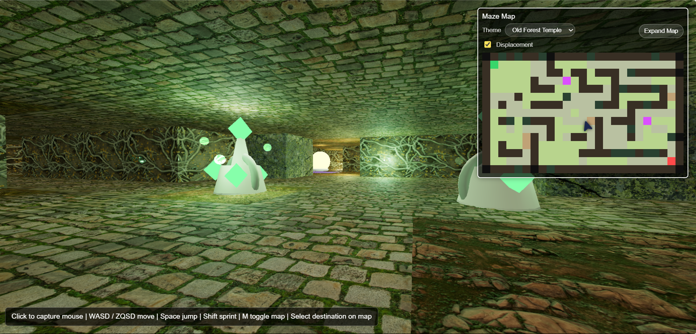
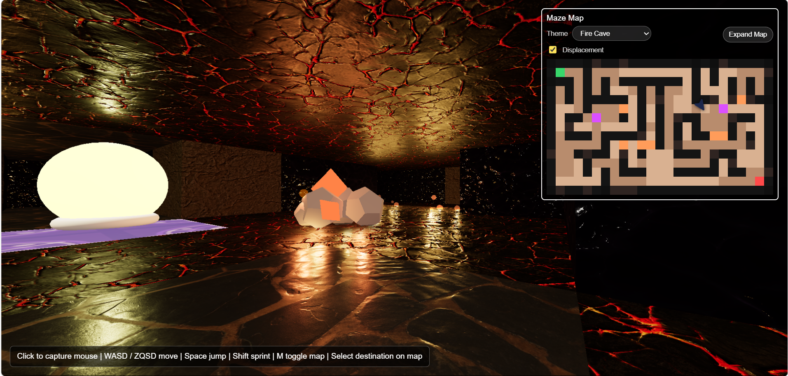
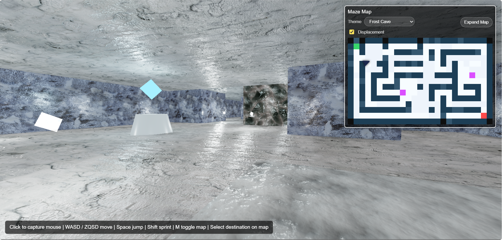
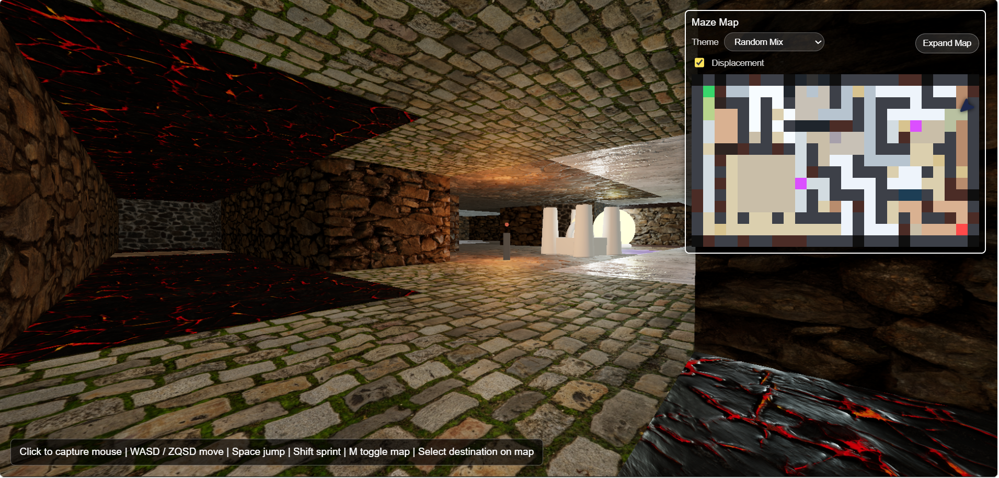
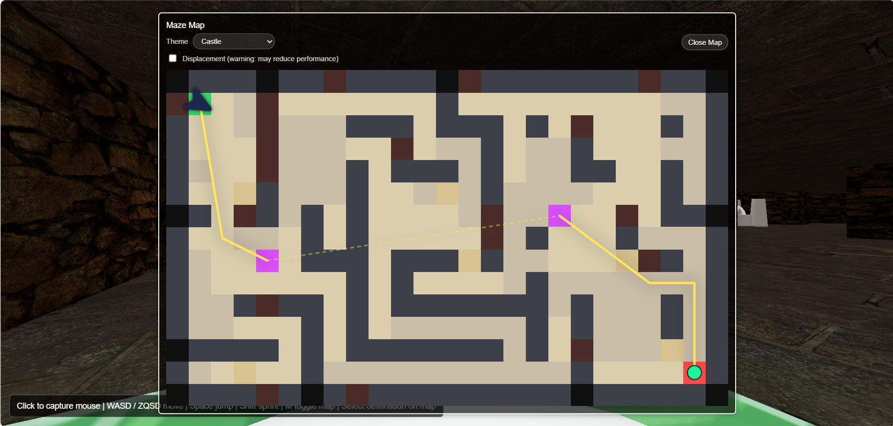
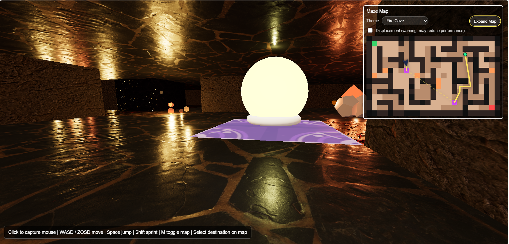
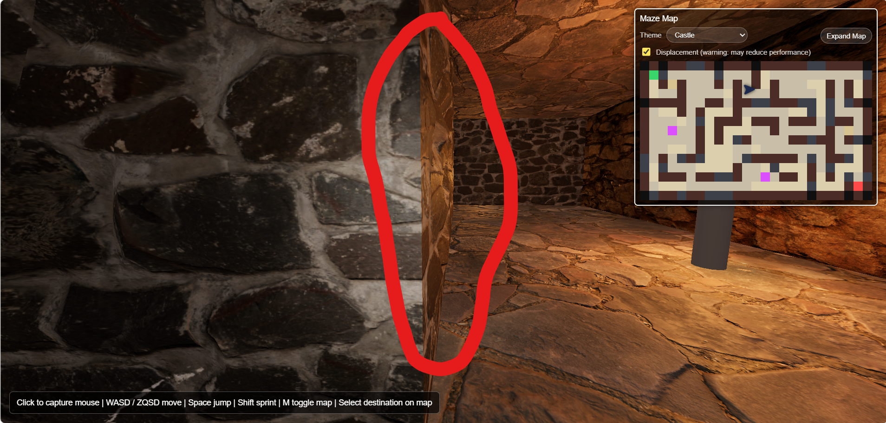
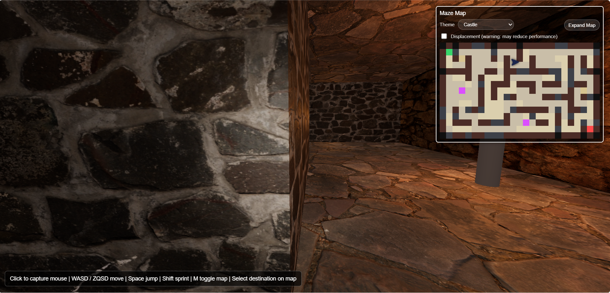

# Doom Maze Prototype - Project Report

**Authors:** Louis De Gruyter, Sebastiaan Delodder  
**Date:** 2026-04-30  
**Course:** Computer Graphics

## Project summary
This project is a small first-person maze experience built with Three.js. It combines procedural maze generation, a 3D world built from the same maze data, a minimap with shortest-path guidance, and collision-aware movement. The focus of our work was on implementing and understanding some core computer graphics and game-logic techniques.

The general runtime flow used is: generate one logical maze -> derive a minimap and 3D geometry from it -> build a collision octree from wall and object collision boxes -> start a first-person controller and per-frame loop. All gameplay systems share the same maze data, which keeps the minimap, rendering, and collision consistent.

If you have both a dedicated and integrated GPU, it is recommended to run the project on the dedicated GPU for better performance, especially when displacement mapping is enabled (the initial load can be quite expensive). To do this on Windows, you can you to your settings -> Display -> Graphics settings, and add the browser executable (e.g. Chrome or Edge) to use the high-performance GPU.

## Team contributions
- **Louis De Gruyter**: Collision octree implementation, pathfinding, player movement and controls, minimap route overlay.
- **Sebastiaan Delodder**: Maze generation, minimap generation, theme data, and 3D world generation support.
- **Joint work**: 3D world building, textures, reflections, lighting, displacement mapping, collision tuning, performance optimizations, and report writing.

## 1. Creating the maze and 3D world
The first task was to create a random maze floor plan. Based on this grid, a 3D maze is generated with geometric primitives (cubes, tiles) and populated with corridors, rooms, teleports, objects, and light sources. Objects and lights are theme-specific so different sections of the maze are visually distinct. Texture maps are applied to floors, walls, and ceilings, with normal/bump mapping being used and optional displacement mapping used for stronger surface depth on textures.

The maze is generated as a grid of cells that starts fully walled. The generator then applies several passes so the output looks like a mix of rooms and corridors instead of a pure corridor labyrinth. It places rooms of certain sizes, carves corridors, opens connector walls between regions, softens some dead ends by placing small rooms, and marks start, goal, and teleport cells. The carving happens with a depth-first search, which gives a more classic maze structure with long corridors and few loops. Some dead ends are extended or expanded into small rooms to reduce frustration and add variation. Teleport pads are placed as paired links using a scoring method (open area preference, distance from start/goal, distance between pads, ...). If a disconnected room remains, one teleport pair is added to link it back to the reachable area. Wall materials are assigned after this layout is known, so walls can be themed based on their region.

The 3D world is built directly from the generated maze grid. Walkable cells become floor and ceiling tiles, wall cells become box-shaped wall primitives, teleport cells get glowing markers, and selected regions receive decoration clusters (pile of rocks, ...).

What we learned:
- A single DFS carve is fast but produces monotonous mazes in its simple form. Adding room and connector passes creates a more traversable and visually interesting layout without losing randomness.
- We had to look for multiple alternative maze generation combinations so that our maze would not look like a pure corridor maze. The final result is a mix of rooms and corridors, which is more fun to explore and gives more variety in the 3D world.

### Theme examples

## 2. Shortest path finding and minimap
The minimap route uses breadth-first search over the maze grid. Each floor cell is a node, and edges connect the four orthogonal neighbours that are not blocked by walls. Teleport pads are modeled as normal edges, so the path can include teleport hops if they are faster than walking. The pathfinding returns a list of cell coordinates that the player can follow to reach the destination. The minimap draws this route as a line overlay on top of the maze layout.

BFS was chosen because all walk steps have a uniform cost, so it returns the true shortest path in number of steps. The maze is also small enough that BFS is very fast, and it is simpler to implement than A* or Dijkstra for this use case. The path is recomputed when the player enters a new cell or clicks a new destination. The drawn route on the minimap is a simple line and is simplified for open areas so it offers a more "straight" path that is easier to follow visually, rather than a line that zigzags through every cell.

### Minimap examples

## 3. 3D world organization and geometric primitives
The 3D world is built from small reusable primitives. Floor and ceiling tiles are generated from planes or thin box geometry. Walls are box primitives sized to the tile dimensions and wall height. Teleport markers are spheres slightly above the floor. Decorations are clusters of cylinders, boxes, cones, torus shapes, octahedrons, and dodecahedrons chosen per region theme.

All meshes are grouped under one maze root group. This keeps rebuilds simple when displacement is toggled. Window resizing is handled by updating the camera aspect ratio and renderer size, so the canvas continues to fill the browser window.

## 4. Moving in 3D and visibility
Mouse movement drives yaw and pitch through pointer lock controls. Keyboard input defines local movement and is rotated into world space by the camera yaw. The implementation supports commonly used keyboard layouts: W/Z/ArrowUp for forward, S/ArrowDown for backward, A/Q/ArrowLeft for left movement, and D/ArrowRight for right movement. Mouse movement is used for looking around.

Movement is tested before it is committed. The player is represented by an upright bounding box around the camera eye position. The controller queries the octree for nearby collision boxes and resolves movement axis by axis. Jumping and gravity are also handled in the controller, and frame delta is clamped so lag or tab switching does not cause large movement jumps.

For hidden-surface determination, the project mainly uses the standard Three.js/WebGL rendering pipeline. When surfaces overlap on screen, such as a wall in front of another object, the WebGL depth buffer decides which surface is closest to the camera and displays that one. Surfaces behind it are hidden automatically.

Three.js also performs object-level frustum culling, which means that meshes completely outside the camera view are skipped. We did not add more advanced portal culling or BSP-based visibility because the maze is small enough for the default system. We briefly tested region-based and line-of-sight visibility for dynamic objects and lights to save some performance (more specifically for the displacement mapping), but this caused visible pop-in and light flickering when moving around corners and minimal performance gains, so it was not used in the final version.

## 5. Lighting, reflections, and shadow trade-offs
We intentionally chose a closed-off corridor experience with ceilings. This gave the game a more narrow atmosphere, but it also limited the lighting possibilities without making the scene expensive or too dark. "Hard shadowing" from every torch, LED lamp, crystal, ember, and teleport marker was not used as the main solution because the number of local light sources made it costly and caused the project to crash occasionally.

The final lighting setup is a bit more layered. The hemisphere and ambient lights keep corridors traversable with emissive lighting, a small player-following light prevents complete darkness, and local point lights from decorations add theme-colored lighting that reacts with the wall and floor materials. This made the textures feel more alive while keeping the maze playable. We made the teleport pads emissive and added a small point light to them, so they are visible from a distance and give a nice glow effect without needing expensive shadows.

Some reflection/specular highlights are still visible through walls on shiny textures (see the second image of the minimap example on the left-hand side of the image). We first tried a pop-in style structure where lights were activated based on line of sight, but that caused distracting flickering and sudden light changes when crossing corridors. We also considered screen-space reflections, a technique often used in games, but it gave inconsistent results, especially when looking at the floor, in a closed maze because it only works with visible screen information. A solution to include the occluded geometry was to explicitly configure shadow-casting for objects and the light sources, but this increased the overall darkness and cost of the initial maze build. We left the remaining reflection artifacts because it adds some brightness to a closed-ceiling map that would otherwise become too dark. 

Thus, the code still contains shadow settings for main meshes and a limited number of light sources, but shadow casting is deliberately restricted to a minimum. This was a trade-off between visual depth, performance, and traversability.

## 6. Texture mapping, bump mapping, and displacement
Textures are loaded through texture-map descriptors. These descriptors define which maps belong to each material, including diffuse/base color, normal, ambient occlusion, roughness, specular, metalness, emissive, and displacement/height maps. Not every texture uses every map, but the system supports them so each theme can have different surface behavior.

Normal maps are used to make bricks, rocks, panels, ice, and floor tiles look deeper without changing the actual geometry. Ambient occlusion maps darken small cracks and surface details, while roughness and specular maps control how matte or shiny materials appear.

World-aligned UVs were used so neighbouring wall and floor tiles line up more naturally and show fewer seams between them. Displacement mapping was added as an optional feature: it physically moves vertices using height maps, giving stronger depth than normal mapping. However, it is more expensive because floors, walls, and ceilings need extra subdivisions to make this work. Edge displacement also had to be faded or locked near tile borders to avoid intersections or visible gaps between neighbouring tiles.

### Displacement comparison

## 7. Collision detection with the octree
Collision is handled in two phases. First, the player bounding box queries the octree to retrieve only nearby wall, ceiling, and object boxes. Second, exact AABB intersection tests are performed against those candidates. This is much faster than testing every wall and decoration every frame in a "simple implementation".

The octree starts with a root bounding box around all collision entries. When a node contains too many entries and the maximum depth is not reached, it subdivides into eight child boxes. Entries are pushed deeper only if they fit fully inside one child, otherwise, they stay in the parent. This is safer for collision because objects that cross split planes cannot be missed.

A key lesson in our implementation was that collision quality depended more on the inserted boxes than on the octree itself. Full tile boxes are correct for walls, but decorations need smaller collision boxes so the player can still walk on tiles containing props. In an early implementation, tiles became blocked by larger decoration which made passage sometimes impossible if it was situated on a narrow corridor. We switched to smaller boxes for decorations, and we also made sure to exclude purely visual objects that the player should be able to walk through, such as glowing embers, flame meshes, LED glows and particles.

## 8. Octree build time and optimization ideas
The octree is built once when the maze is created or rebuilt. The benchmark was run on a laptop with an Intel i5-13420H and 24 GB DDR5 RAM, using 100 runs per maze size.

| Size | Runs | Mean ms | Mean us | Std ms | Min ms | Max ms |
|---:|---:|---:|---:|---:|---:|---:|
| 10 | 100 | 0.000 | 0 | 0.000 | 0.000 | 0.000 |
| 100 | 100 | 0.060 | 60 | 0.237 | 0.000 | 1.000 |
| 1000 | 100 | 0.600 | 600 | 0.616 | 0.000 | 2.000 |
| 10000 | 100 | 5.870 | 5870 | 1.689 | 4.000 | 14.000 |
| 100000 | 100 | 76.110 | 76110 | 7.356 | 64.000 | 105.000 |

Possible speedups include merging adjacent wall tiles into larger boxes, reducing decoration collision entries in the octree, building the tree in a Web Worker which allows for background processing. Caching/reusing nodes when only textures change, or switching to a fixed uniform grid for this regular tile-based world, meaning that each tile corresponds to one grid cell, because the maze is divided into a grid of cells and the walls that will stay in the same place.

## 9. Octree compared to kd-tree and BSP-tree
An octree fits this project because the maze is axis-aligned, grid-based, and made mostly from box-like primitives. AABB queries are simple, rebuilding is straightforward, and the implementation is easy to debug. We would definitely use an octree for voxel worlds, blocky levels, grid-based mazes, or other relatively regular 3D scenes where broad-phase collision queries are needed.

Its limitation is that it subdivides space uniformly. This works well for our regular tile-based maze, but it is less efficient for long, thin objects or unevenly distributed geometry because many objects may stay high in the tree. A kd-tree can adapt its splits better to uneven data, while a BSP tree can be better for complex static indoor scenes with portal-style visibility (= “which rooms can the camera see through which doors?”). We would avoid an octree for highly non-uniform scenes, large irregular geometry sets, or projects where advanced visibility/portal culling is the main goal.

## 10. Ray tracing using the octree (optional)
**Status:** Not implemented in the current project.

Planned approach:
- Traverse the octree by intersecting the ray with node bounds.
- Visit children in order of entry distance to allow early exit on first hit.

Expected complexity:
- Average: O(log n + k), where k is the number of candidate primitives tested.
- Worst case: O(n) if the ray intersects many nodes or the tree becomes unbalanced.

## 11. Challenges and lessons learned
Predictive collision worked better than pushing the player out after a collision (something we tried earlier). When multiple walls overlapped, push-out correction would feel unstable because it created a "bouncing" effect as the player was pushed out of one wall and sometimes immediately collided with another. Checking the movement first and only applying it when valid gave smoother "wall sliding".

Tile-local UVs created visible seams between tiles. World-aligned UVs made the textures continue more naturally across floors and walls. Displacement mapping also improved the look, but only after adding enough geometry and controlling the displacement near edges. Because it is heavier than normal mapping, it was kept optional.

Lighting was the hardest visual problem. Since the maze is closed off with corridors and ceilings, it can become too dark very quickly. However, too many realtime shadows or screen-space effects caused performance issues and visual inconsistencies. The final lighting therefore focuses on a more readable navigation, dynamic local lights, and more distinct theme atmosphere instead of fully realistic shadows from every light source.
